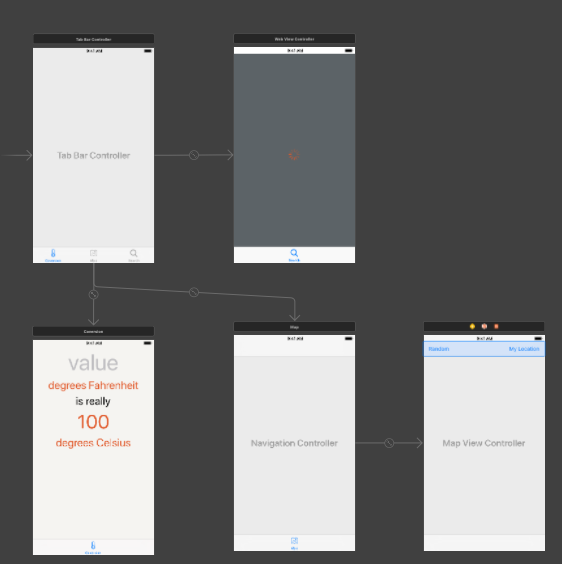

# WorldTrotter

## Overwiew
App consists of three unrelated functionalities : WEB, MAP, TEMPERATURE CONVERTER.

## Implemented Bits
* use of tabBar controller
* use of UITextField, implementing delegate methods to control user input
* detecting current hour of day and updating UI accordingly
* use NumberFormatter
* use WebKitView , load and present website , implement WKNavigationDelegate methods
* use activity indicator to show user action is taking place
* use UISegmentedControl, adding autolayout constraints in code
* use MapView, use delegate methods
* creating custom map locations with MKAnnotation
* use CLLocationManager to request user location info
